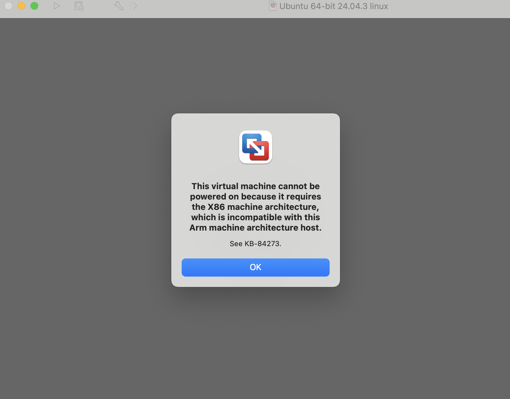

# Linux Troubleshooting Lab: Setup and Essential Commands


## Local Setup Prerequisites (macOS)

Required software for running this lab on Apple Silicon Macs (M1/M2/M3):

1. **VMware Fusion Player** (Free for personal use)
2. **Ubuntu Desktop ARM64 ISO** (Required for MAC Apple Silicon compatibility)

---

### Step 1: Download Ubuntu ARM64 Version

* **For Apple Silicon Macs:** You MUST use ARM64 version
* **Download:** **Ubuntu 25.04 ARM64** from [ubuntu.com/download/desktop](https://ubuntu.com/download/desktop)
* **Why ARM64?** Apple Silicon chips require ARM architecture - standard Intel/AMD versions will cause compatibility errors

---

### Step 2: Download VMware Fusion Player

* **Download:** https://www.vmware.com/products/fusion/fusion-evaluation.html
* **Select:** "Personal Use License" (Free)
* **Install:** Standard installation process

---

### Step 3: Create Virtual Machine

1. Open **VMware Fusion Player**
2. Drag and drop the **Ubuntu 25.04 ARM64 ISO file** into VMware window
3. Complete the on-screen installation steps to set the user account and finish the Ubuntu setup.

 


### Note

**Apple Silicon Requirement:** Standard x86_64 (Intel/AMD) Ubuntu versions are incompatible with Apple Silicon Macs and will throw architecture errors.

**If you see this error:** "The X86 machine architecture virtual machine is incompatible with the Arm machine architecture host"

- Solution: Use **Ubuntu ARM64 version only**

---

##  Linux Fundamentals - Deep Explanations

## 1. Command Line Basics

**What is the Command Line?**
- Think of it as "text messaging" your computer
- Instead of clicking icons, you type commands
- More powerful than GUI - you can do things faster

**Understanding the Prompt:**
```bash
[username@computer ~]$
```
- `$` = regular user (you)
- `#` = root user (administrator - be careful!)

To exit: Type exit or close the window


### Basic Command Structure
```text
command [options] [arguments]
```

### Essential Shell Features
| Feature | Control | Description |
|---------|---------|-------------|
| TAB completion | Press Tab | Type part of command → Auto-complete |
| Command history | Up/down arrows, Ctrl+R | Navigate and search history |
| Background jobs | Add &  (e.g., firefox &)| Run program in background |
| Pausing | Ctrl+Z to pause, fg to resume, bg for background | Manually manage running processes |


### Getting Help
**Getting help and understanding commands is the first rule of Linux troubleshooting.**

#### Manual Pages (Man Pages)
The man command provides the primary system documentation for commands and configuration files.
```bash
man commandname
```
**Man Page Navigation:**

- Spacebar = Next page

- /searchterm = Search within the page

- q = Quit


### Other Help Commands
#### Quick Descriptions
**These commands offer fast summaries, especially useful when you don't know the exact command name.**
```bash
whatis command      # Brief description
apropos keyword     # Find commands about a topic
```
#### Info Pages
**The info command provides hypertext-style documentation, often offering more detailed, beginner-friendly explanations than man pages, especially for GNU tools.**
```bash
info commandname   # Detailed, hypertext documentation (use q to quit)
```

## 2. Hardware Management
### CPU Information
**These commands are essential for verifying the system architecture and capacity, which is crucial for software compatibility and licensing.**
```bash
lscpu               # Detailed CPU info (architecture, core count)
uname -a            # System info including architecture and kernel version
```

### Hardware Detection
**Use these commands to inventory connected peripherals and storage devices for troubleshooting driver or mounting issues.**
```bash
lspci               # List all PCI devices (graphics, network, etc.)
lsblk               # Show disks and partitions
```

### Disk Types & Filesystems
**Understanding storage structures is necessary for preparing and mounting drives.**
- Disk Types: `SATA/USB: /dev/sda;` `NVMe: /dev/nvme0`.

- Partitioning: MBR (Max 2TB) vs. GPT (Modern, large disks).

- Filesystems: ext4 (Default Linux), XFS (For large files), Btrfs (Advanced features).

### Disk Space and Mounting Drives
CRITICAL: Always check free space and unmount before removing a drive to prevent data corruption.
```bash
df -h               # Show Disk Free space in human-readable format (Essential check!)
umount /mount/point # Safely detach a mounted device
```

## 3. File Management
### Essential Navigation
**Basic commands for moving around the system's file hierarchy.**
```bash
pwd                 # Show current directory ("Print Working Directory")
ls                  # List files
ls -la              # List files with detailed permissions and hidden files
cd directory        # Change directory
```

**Examples:**

```bash
$ pwd
/home/john
$ ls
Documents Downloads Music
$ cd Documents
$ pwd
/home/john/Documents
```

### File Operations
**Manipulating files is a core daily task; always exercise caution with deletion (rm).**
```bash
touch filename      # Create empty file
cp file1 file2      # Copy file
mv old new          # Move/rename file
rm filename         # Delete file (PERMANENT - no trash!)
```

### Directory Management
**Commands for creating, renaming, and removing directories.**
```bash
mkdir folder        # Create directory
mkdir -p a/b/c      # Create nested directories (parent directories first)
rmdir folder        # Remove EMPTY directory only
rm -r folder        # Remove directory and contents (Recursive - DANGER!)
```

### Important Directories (File System Hierarchy)
**Understanding the Linux File System Hierarchy (FHS) is non-negotiable for system administration.**
| Directory | Purpose |
| :--- | :--- |
| / | Root directory (The base of the entire file system) |
| /home | User files |
| /etc | Configuration files (**CRITICAL**) |
| /tmp | Temporary files (Cleared on reboot) |
| /var | Variable data (logs, mail, web content) (**CRITICAL**) |


### File Paths
**The methods for addressing files on the system.**
- Absolute Path: /home/user/file.txt (Starts from root)

- Relative Path: Documents/file.txt (Starts from the current location)

- Home shortcut: ~/Documents (Short for /home/user)

### Wildcards
**Special characters used to match patterns of filenames in commands like ls, cp, or rm.**
| Wildcard | Description |
| :--- | :--- |
| * | Match any characters |
| ? | Match single character |
| [ ] | Match specific characters |


## 4. Searching and Processing Data
### Regular Expressions (RegEx)
**Regular Expressions are patterns used by commands like grep to find specific text within files. They are essential for log analysis and data extraction.**

| Symbol | Meaning | Example |
| :---: | :--- | :--- |
| ^ | Start of line | `^error` finds lines starting with "error" |
| $ | End of line | `status$` finds lines ending with "status" |
| . | Any single character | `a.b` finds "acb", "a2b", etc. |
| * | Zero or more repetitions | `a*` finds "", "a", "aa", "aaa" |
| + | One or more repetitions | `a+` finds "a", "aa", "aaa" |
| ? | Zero or one occurrence | `colou?r` finds "color" or "colour" |

### Search Commands
**These commands allow you to locate files and specific content within them quickly, which is fundamental to troubleshooting.**
```bash
grep pattern file    # Search inside files
grep -r pattern dir  # Recursive search (searches all files within a directory and its subdirectories)
find dir -name "*.txt"  # Find files by name (e.g., find all .txt files)
```

### Data Processing Utilities
**These tools are often used together via pipes to clean, format, and summarize raw data (e.g., summarizing web server logs).**
```bash
wc file              # Word count
cut -d: -f1 file     # Extract fields
sort file            # Sort lines
cat file1 file2      # Concatenate (combine) files and display their content
```

### Redirection and Pipes
**Redirection changes where a command gets its input or sends its output. Pipes connect the output of one command directly to the input of another. These are the building blocks of automation.**
```bash
command > file       # Overwrite output to file
command >> file      # Append output to file
command 2> error.log # Redirect errors only 
command < input.txt  # Redirect input (use a file as input for a command)
```

```bash
command1 | command2  # Pipe output to another command
ls -l | grep txt | wc -l  # Chain multiple commands: List files, filter for "txt", count the resulting lines
```

## 5. Process and Package Management
### Viewing Processes
**Monitoring system resources is essential for diagnosing slowdowns, memory leaks, or runaway applications in a cloud environment.**
```bash
ps aux               # Show all processes
top                  # Live process monitor (press 'q' to quit)
free -h              # Memory usage in human-readable format
```

### Service Management (Systemd)
**Systemd is the system and service manager for modern Linux distributions. It is used to manage critical background services (daemons) like web servers, databases, and logging.**
```bash
systemctl status apache2   # Check service status (CRITICAL for troubleshooting)
systemctl start apache2    # Start a service
systemctl stop apache2     # Stop a service
systemctl enable apache2   # Configure the service to start automatically at boot
```

### Package Management (Debian/Ubuntu)
**The Advanced Packaging Tool (APT) is used to install, update, and remove software. Using sudo grants temporary root permissions to perform these administrative tasks.**
```bash
sudo apt update      # Update package lists
sudo apt upgrade     # Upgrade all installed packages to their newest versions
sudo apt install pkg # Install a new package
sudo apt remove pkg  # Remove package
```

### Understanding Load Average
The load average is a crucial metric that tells you how busy your system is. It appears as three numbers: 1-minute, 5-minute, and 15-minute averages.

Interpretation: A value of 1.0 indicates that, on average, a single-core CPU is fully utilized. A server with a load average consistently above its CPU core count is overloaded.

## Text Editing
### Nano (Easy Editor)
**Nano is a simple, user-friendly editor for quick configuration file changes.**
```bash
nano filename.txt
```
Essential Commands:

- Ctrl+O = Save

- Ctrl+X = Exit

- Ctrl+K = Cut line

- Ctrl+U = Paste

- Ctrl+W = Search

### Vi/Vim (Powerful Editor)
**Vim is a highly efficient, modal editor favored by advanced users. It operates in three main modes:**
Three Modes:
1. Command Mode (Default): Navigation and commands.

2. Insert Mode (Press i): Used for typing text.

3. Ex Mode (Press :): Used for saving and quitting.

**Essential Commands:**

| Mode | Command | Action |
| :---: | :---: | :--- |
| **Command** | i | Enter Insert Mode |
| **Insert** | Esc | Return to Command Mode |
| **Command** | :w | Save (Ex Command) |
| **Command** | :q | Quit (Ex Command) |
| **Command** | :wq | Save and quit (Ex Command) |
| **Command** | :q! | Quit without saving (Force Quit) |

## Scripting Basics
### Creating Scripts
**All Bash scripts must start with a shebang line, which tells the operating system which interpreter to use (in this case, /bin/bash).**

```bash
#!/bin/bash
# Your commands here
echo "Hello World"
```

### Execution
**A script must have execute permission before it can be run directly.**
```bash
chmod +x script.sh   # Makes the script executable
./script.sh          # Runs the script (./ means "in the current directory")
```

### Variables and Arguments
**Variables store temporary data (name). Arguments are values provided to the script when it's run, automatically stored in special variables ($1, $2, etc).**
```bash
name="John"          # Assigns a value to a user-defined variable
echo "Hello $name"   # Uses the user-defined variable
echo "First argument: $1" # Refers to the first value passed to the script
echo "All arguments: $@" # Refers to all values passed to the script
echo "Script name: $0"  # Bonus: Refers to the name of the script itself
```

### Conditionals
**Conditionals (if/then/else) allow your script to make decisions by testing the status of a file, a variable, or the result of a command.**

```bash
if [ -f "$file" ]; then
    echo "File exists"
else
    echo "File not found"
fi
```
(The -f test operator checks if the variable $file points to a regular file.)

### Loops
**Loops (for and while) automate repetitive tasks, running a block of code multiple times either for every item in a list (for) or until a specific condition is met (while).**
```bash
for file in *.txt; do        # FOR Loop: Iterates over a list (e.g., all files ending in .txt)
    echo "Processing $file"
done

count=1                     # WHILE Loop: Runs repeatedly as long as a condition is TRUE
while [ $count -le 5 ]; do  
    echo "Count: $count"
    count=$((count + 1))
done
```

## 6. User and Security
### Account Types
**Managing user accounts and permissions is fundamental to system security (Principle of Least Privilege).**

- Root: UID 0 (full system access/administrator)

- System: UID 1-999 (service accounts,This numerical range is reserved for System Accounts)

- User: UID 1000+ (regular users)


### Account Files
**These files store critical information about users and groups, all located in the /etc directory.**
- `/etc/passwd` - User account details (UID, home directory, shell).

- `/etc/shadow ` - Encrypted passwords (only readable by root).

- `/etc/group` - Groups and their members.

### Security Commands
```bash
whoami               # Current user
id                   # User identity
who                   # Show logged-in users
w                     # Show users + what they're running
```
**Root Access Methods**
sudo (Recommended):
```bash
sudo command         # Run single command as root (SAFE)
sudo -i              # Interactive root session
```
- Uses your password

- Creates audit trail (nonrepudiation)

**su (Less Safe):**
```bash
su -                 # Switch to the root user (less safe, requires root password)
```
- No audit trail (repudiation environment)

### File Permissions
**Linux uses permissions to control who can Read (r), Write (w), or Execute (x) a file or directory.**
| Permission | Symbol | Octal Value |
| :--- | :--- | :--- |
| Read | r | 4 |
| Write | w | 2 |
| Execute | x | 1 |

### Changing Permissions
**Octal Method: This method assigns permissions using a single **three-digit number** (e.g., 755), where each digit represents the permission level for the **Owner**, **Group**, and **Others**. The number is calculated by summing the **Read (4), Write (2), Execute (1)** values.**
```bash
# Breakdown of 755: Owner (7 = 4+2+1), Group (5 = 4+1), Other (5 = 4+1)
chmod 755 file.txt    # Sets rwxr-xr-x (Owner has read/write/execute, Group/Others have read/execute)
chmod 644 file.txt    # Sets rw-r--r-- (Owner has read/write, Group/Others have read only)
```

**Symbolic Method: This method uses letters (u, g, o, a) and symbols (+, -, =) to add or remove specific permissions.**

```bash
chmod u+x script.sh   # Adds execute permission (+) for the Owner (u). Makes a script executable.
chmod go-w file.txt   # Removes write permission (-) for Group (g) and Others (o).
```
### Changing Ownership
**These commands change which user or group is the designated owner of the file, which is essential for proper administration.**
```bash
chown user file.txt          # Change the owner of the file.
chown user:group file.txt    # Change the owner AND the group of the file.
chgrp group file.txt         # Change the group owner only.
```

### Archiving and Compression
**tar (Tape Archiver)**
```bash
# Create archive
tar -czvf archive.tar.gz /path/to/files

# Extract archive
tar -xzvf archive.tar.gz

# List contents
tar -tzf archive.tar.gz
```
| Flag | Meaning | Purpose |
| :---: | :--- | :--- |
| -c | Create | **C**reates a new archive bundle. |
| -x | Extract | E**x**tracts files from an existing archive. |
| -t | List | Lists the **t**able of contents of the archive. |
| -v | Verbose | Shows a detailed list of files being processed (good for seeing progress). |
| -f | File | **MANDATORY:** Specifies the **f**ilename of the archive (the word that follows). |
| -z | Gzip | Compresses/decompresses using the **Gzip** utility (creates `.tar.gz`). |
| -J | XZ | Compresses/decompresses using the **XZ** utility (strongest compression, creates `.tar.xz`). |

## 7. Network Troubleshooting
### Essential Network Commands
**These commands are crucial for verifying network connectivity, checking open ports, and diagnosing service communication failures.**
```bash
ip a            # Show IP addresses and interfaces (modern replacement for ifconfig)	
ping hostname   # Test basic network connectivity	
curl URL        # Test connectivity and retrieve data from web services	
ss -tulpn       # List open ports, protocols, and the associated process (modern netstat)
```

---
## Linux Skills to Practice

- Service management: `systemctl start/stop/restart apache2`
- File permissions: `chmod`, `chown`, `chgrp`
- Process monitoring: `ps`, `top`, `htop`, `kill`
- Network troubleshooting: `ping`, `curl`, `netstat`, `ss`
- Log analysis: `journalctl`, `tail -f`, `grep`
- User management: `adduser`, `passwd`, `usermod`
- Disk management: `df -h`, `du -sh`, `fdisk`

## Troubleshooting Common Issues

1. **Service won't start:** Check `systemctl status` and `journalctl`
2. **Permission denied:** Verify file permissions with `ls -la`
3. **Network issues:** Test connectivity with `ping` and `curl`
4. **Disk space:** Monitor with `df -h` and clean up with appropriate commands

**Resources used:**
- Interactive: https://www.netacad.com/courses/linux-essentials?courseLang=en-US *really helpful*
- official LPI material: https://learning.lpi.org/pdfstore/LPI-Learning-Material-010-160-en.pdf
- extra: https://ebookcentral.proquest.com/lib/westerngovernors-ebooks/reader.action?c=UERG&docID=6002518&ppg=338
